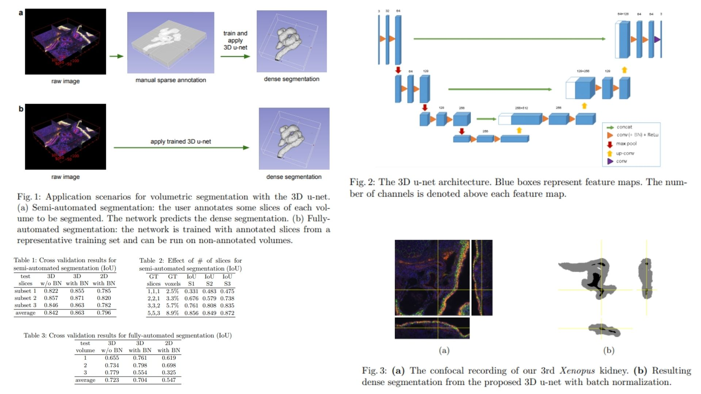

# 🎆 Sparse3DUNet-Replication — Volumetric Segmentation from Sparse Annotation

This repository provides a **PyTorch-based research replication** of  
**3D U-Net: Learning Dense Volumetric Segmentation from Sparse Annotation — Çiçek et al., 2016**,  
reproduced as a **theory-driven volumetric segmentation framework**.

The project translates the paper’s **3D encoder–decoder architecture, sparse supervision strategy, and elastic deformation model**
into a clean, modular research codebase.

- Enables **dense 3D segmentation from sparse 2D slice annotations** 🧊  
- Implements **3D convolutional U-Net with multi-scale context aggregation** 🧠  
- Integrates **elastic volumetric deformation for data augmentation** 🌀  

**Paper reference:**  
[3D U-Net: Learning Dense Volumetric Segmentation from Sparse Annotation — Çiçek et al., 2016](https://arxiv.org/abs/1606.06650) 📄

---

## 🌌 Overview — Sparse Volumetric Segmentation Pipeline



The core idea:

> Dense 3D understanding can emerge from sparse 2D supervision.

Instead of requiring full voxel-wise annotation:

$$
V \longrightarrow Y
$$

we train the model from **partially labeled slices**:

$$
V \xrightarrow{\text{sparse}} \hat{Y}
$$

where the learning objective is restricted to annotated voxels only.

The network learns a volumetric mapping

$$
f_\theta : \mathbb{R}^{D \times H \times W \times C} \rightarrow \mathbb{R}^{D \times H \times W \times K}
$$

producing a dense segmentation volume $\hat{Y}$ from a sparsely annotated input $V$.

---

## 🔬 Mathematical Formulation

Let the input volume be

$$
V \in \mathbb{R}^{D \times H \times W \times C}
$$

where  
- $D, H, W$ denote spatial dimensions  
- $C$ is the number of imaging channels  

The 3D U-Net learns a voxel-wise classifier:

$$
p(y_{ijk} \mid V) = \text{Softmax}(f_\theta(V)_{ijk})
$$

Training is performed using a **weighted sparse cross-entropy loss**:

$$
\mathcal{L} = - \sum_{i,j,k} w_{ijk} \sum_{c=1}^{K} y_{ijk}^c \log p_{ijk}^c
$$

where  

- $w_{ijk} = 0$ for unlabeled voxels  
- $w_{ijk} > 0$ for annotated slices  
- $K$ is the number of segmentation classes  

This allows learning from only a small subset of labeled slices while generalizing to the full volume.

---

## 🧠 What the Model Learns

- To aggregate **multi-scale 3D context** across volumetric structures 🧭  
- To infer dense segmentation from sparse slice supervision 🧩  
- To model anatomical continuity across adjacent slices 🧬  
- To remain robust under elastic volumetric deformations 🌀  
- To learn volumetric representations from extremely limited annotation 📉  

The segmentation process becomes a **context-driven volumetric inference problem** rather than a slice-wise prediction task.

---

## 📦 Repository Structure

```bash
Sparse3DUNet-Replication/
├── src/
│   ├── model/
│   │   └── unet3d.py                 # 3D U-Net architecture (paper replication)
│   │
│   ├── loss/
│   │   └── weighted_softmax.py      # Sparse-aware weighted loss
│   │
│   ├── dataset/
│   │   ├── sparse_mask.py           # Slice-based sparse annotation handler
│   │   └── augmentation.py          # Elastic deformation, rotation, intensity
│   │
│   ├── pipeline/
│   │   └── forward_pipeline.py      # Volume → Augment → Tiles → U-Net → Output
│   │
│   ├── utils/
│   │   └── visualization.py         # Slice & volume visualization
│   │
│   └── config.py                   # Patch size, num_classes, deformation params
│
├── images/
│   └── figmix.jpg                     
│
├── requirements.txt
└── README.md
```
---


## 🔗 Feedback

For questions or feedback, contact: [barkin.adiguzel@gmail.com](mailto:barkin.adiguzel@gmail.com)
